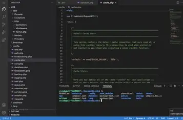

import { Image } from 'astro:assets';
import image02 from './pexels-shawn-henry-2151899038-31940358.jpg';


# Article Factice pour Test CSS

Cet article est généré pour tester la mise en page CSS des articles de la collection `code`. Il contient tous les attributs frontmatter possibles, du code, des images, des listes, des tableaux, et des citations.

## Introduction

Voici une introduction factice pour tester le rendu.

## Exemple de code Python
```python title="test.py" {1}
def hello_world():
    print("Hello, world!")

hello_world()
```

## Exemple de code Bash
```bash title="terminal.sh"
echo "Hello from Bash!"
```

## Exemple de code Git
```bash 
git status
git add .
git commit -m "Test commit"
```

## Image locale



<Image src={image02} alt="Image 4K" width={800} />

## Image distante


## Video local
<video src="/videos/2575219-hd_1920_1080_24fps.mp4" controls width="800" style="max-width: 100%;">
  Votre navigateur ne supporte pas la vidéo.
</video>

## Liste à puces
- Élément 1
- Élément 2
- Élément 3

## Liste numérotée
1. Étape un
2. Étape deux
3. Étape trois

## Tableau
| Syntaxe | Description |
|---------|-------------|
| Header  | Titre       |
| Cellule | Contenu     |

## Citation
> Ceci est une citation pour tester le style des blockquotes.

## Conclusion

Ceci conclut l'article factice pour tester la mise en page CSS.
